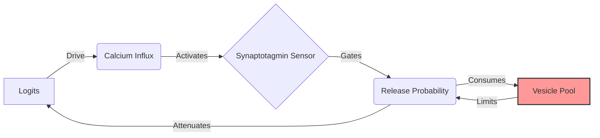

## Description

Bio-Inspired Nanochat reimagines transformers as "living fluids" rather than "frozen crystals" by replacing static weights with computational analogs of synaptic proteins. During inference, connections grow, shrink, fatigue, recover, and reproduce—mimicking biological neurons' energy-constrained efficiency. Grounded in neuroscience literature, the system implements 11+ bio-inspired mechanisms across three backends: Triton GPU kernels (375-line fused kernel), Rust CPU kernels via PyO3, and Python reference implementations. Core mechanisms include presynaptic fatigue (Readily Releasable Pool depletion), postsynaptic working memory (Hebbian consolidation), and structural plasticity (expert multiplication/death based on demand). Systematic optimization uses CMA-ES to tune 48 hyperparameters across all mechanisms.

## Key Features

- **Synaptic protein simulation**: Presynaptic fatigue prevents attention collapse through ATP-constrained neurotransmitter depletion modeling; postsynaptic density implements Hebbian consolidation for working memory
- **Multi-backend implementation**: Production-grade Triton GPU kernels, Rust CPU kernels for inference, and Python reference implementation for validation and research
- **Energy-aware learning**: Models incorporate metabolic constraints (ATP budgets, vesicle pools) forcing efficiency gains similar to biological brains, not just architectural optimization
- **Elastic capacity**: Expert networks multiply/die based on inference demand, enabling adaptive computation without fixed pre-allocation
- **Systematic hyperparameter optimization**: CMA-ES framework tunes 48 parameters across all bio-inspired mechanisms for evidence-based feature selection
- **Comprehensive benchmarking**: Bio vs vanilla transformer comparison with rigorous statistical testing and detailed ablation studies

## README

# Bio-Inspired Nanochat

> **"What if a Transformer had a metabolism?"**

This is a research fork of [Nanochat](https://github.com/karpathy/nanochat) that replaces standard static weights with **computational analogs of synaptic proteins**, implementing biologically-grounded mechanisms for working memory, attention modulation, and neural architecture search.

Standard LLMs are "frozen crystals"—static matrices of `float16` numbers that never change once training is done. **Bio-Inspired Nanochat** is a "living fluid". Its connections grow, shrink, fatigue, recover, and even reproduce *during inference*, mimicking the energy-constrained efficiency of the biological brain.

## 📊 Project Status

This is an **active research project** implementing 11+ bio-inspired mechanisms with systematic evaluation and optimization. See our comprehensive planning documents:

- 📋 [**Full Roadmap**](.beads/) - 69 tasks across 7 epics (Beads tracker)
- 🧬 [**CMA-ES Optimization Plan**](PLAN_TO_USE_CMAES_FOR_HYPERPARAMETER_EXPLORATION_AND_OPTIMIZATION_ACROSS_ALL_BIO_INSPIRED_FEATURES.md) - Systematic hyperparameter tuning for 48 parameters
- 🎯 [**Feature Predictions**](CLAUDE_SONNET45_PREDICTIONS_ON_WHICH_NEW_BIO_INSPIRED_IDEAS_WILL_WORK_BEST_OR_NOT.md) - Evidence-based analysis of which mechanisms will work
- 🚀 [**New Features Roadmap**](NEW_RADICALLY_NEW_BIO_INSPIRED_FEATURES_TO_ADD_IN_MODULAR_WAY.md) - Detailed specs for upcoming mechanisms

**Implementation Status:**
- ✅ **Core Synaptic Mechanisms** (Presynaptic, Postsynaptic, Structural) - Fully implemented
- ✅ **Triton GPU Kernels** - 375-line fused presynaptic kernel
- ✅ **Rust CPU Kernels** - PyO3-based native implementation (50-90% complete)
- 🚧 **Extended Bio Features** - Stochastic release, BDNF, dual weights (in progress)
- 🚧 **Systematic Optimization** - CMA-ES framework for 48 hyperparameters (planned)
- 🚧 **Rigorous Evaluation** - Bio vs vanilla benchmarks with statistical testing (planned)

---

## ⚔️ Tale of the Tape: Silicon vs. Carbon

| Feature | Standard Transformer | Bio-Inspired Nanochat |
| :--- | :--- | :--- |
| **Weights** | 🧊 **Static**: Fixed after training. | 🌊 **Fluid**: Evolve in real-time during inference. |
| **Memory** | 📜 **Context Window**: Limited by `seq_len`. | 🧠 **Associative**: Fast-weights "remember" patterns locally. |
| **Diversity** | 🎲 **Randomness**: Temperature sampling. | 🔋 **Metabolism**: Synapses "tire out", forcing new paths. |
| **Capacity** | 🏗️ **Fixed**: Pre-allocated size (e.g., 32 layers). | 🏙️ **Elastic**: Experts multiply/die based on demand. |
| **Learning** | 🏫 **Offline**: Only learns during Backprop. | ⚡ **Online**: "Learns" context via Hebbian consolidation. |
| **Optimization** | 🎯 **Grid Search**: Manual hyperparameter tuning. | 🧬 **Evolution**: CMA-ES optimizes 48 parameters systematically. |
| **Kernels** | 🐍 **Python/CUDA**: Single backend. | ⚡ **Multi-Backend**: Triton GPU + Rust CPU + Python reference. |

---

## 🧠 The "Wetware" Stack: From Biology to Math

We map specific cellular mechanisms from the [Synaptic Cleft](https://en.wikipedia.org/wiki/Chemical_synapse) directly to tensor operations. This architecture is grounded in neuroscience literature and the blueprints found in `prompts/`.

### 1. Presynaptic Biophysics (The Sender)
*The mechanism of "Fatigue" and "Boredom"*

**The Biology**: Neurons run on batteries (ATP). If a neuron shouts too much (fires continuously), it runs out of neurotransmitter vesicles (chemical ammo). It *must* rest to reload.

**The Math**: We track a fluid reservoir `RRP` (Readily Releasable Pool) for every attention head. High attention scores drain the pool.

**The Effect**: A physically-grounded **frequency penalty**. The model literally *cannot* attend to the same token endlessly. It gets "bored" (depleted) and naturally shifts focus to novel information.

**Implementation**: Three backends for production use:
- **Triton GPU Kernel** (`bio_inspired_nanochat/kernels/presyn_fused.py`): 375-line fused kernel, 3 passes over attention
- **Rust CPU Kernel** (`rust_src/src/presyn.rs`): PyO3-native implementation for CPU inference
- **Python Reference** (`tests/test_rust_kernels.py`): 130-line pure Python for validation

### 2. Postsynaptic Density (The Receiver)
*The mechanism of "Working Memory"*

**The Biology**: "Neurons that fire together, wire together." A transient thought b
...[truncated]

## Links

- [GitHub](https://github.com/Dicklesworthstone/bio_inspired_nanochat)
- [Original Tweet](https://x.com/doodlestein/status/2005815788628762640)
